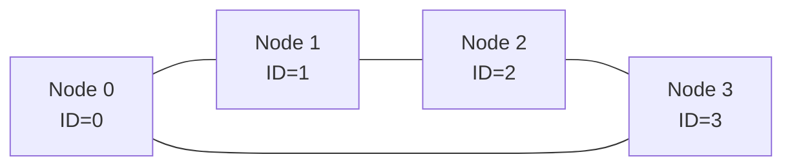
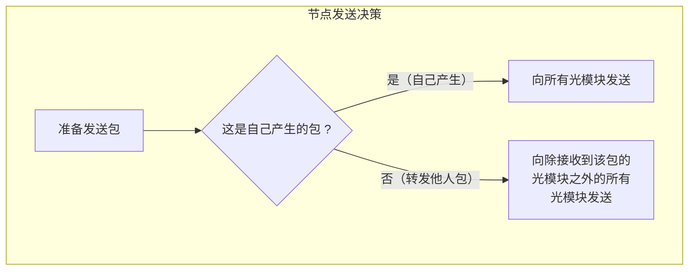
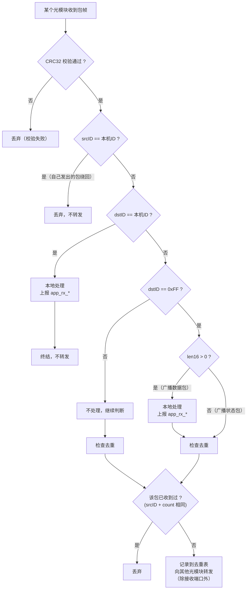
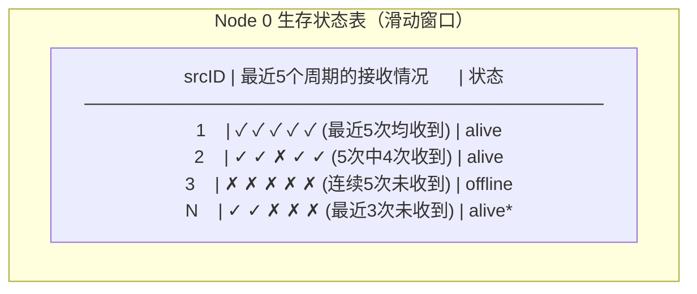
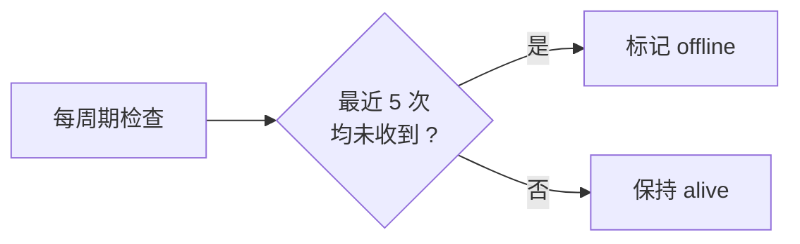
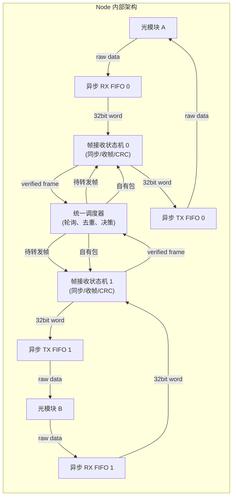

# 网络设计原则

## 1. 整体架构

该网络由 FPGA 逻辑驱动，每块板卡为一个网络节点。单块板卡配备 2 个光模块（支持双工通信），未来可扩展更多光模块。各节点通过光模块互联。

## 2. 环状拓扑

每个节点通过两个光模块与邻居节点相连，所有链路上均可双向收发，形成环形网络：



> 未来扩展更多光模块后，拓扑可演变为网格状或其他更复杂的互联结构，而不局限于环形。

## 3. 节点接口

每个节点模块接口如下：

```verilog
module node (
    input  clk, rst,
    input         node_id_valid,     // 节点 ID 脉冲有效
    input  [7:0]  node_id,           // 本节点 ID 脉冲幅值
    input         rx_clk0, rx_clk1,  // 光模块 0/1 的 RX 时钟
    input         tx_clk0, tx_clk1,  // 光模块 0/1 的 TX 时钟
    input  [31:0] in0, in1,          // 光模块 0/1 的 RX 数据
    input         valid_in0, valid_in1,
    input         app_frame_valid,   // 上层请求发送数据帧
    output        app_frame_ready,
    output        app_frame_accepted,
    input  [7:0]  app_dst_id,
    input  [15:0] app_len16,
    output [15:0] app_payload_addr,
    input  [31:0] app_payload_data,
    output        app_rx_frame_valid, // 收到本节点数据帧
    input         app_rx_frame_ready,
    output [7:0]  app_rx_src_id,
    output [7:0]  app_rx_dst_id,
    output [15:0] app_rx_count,
    output [15:0] app_rx_len16,
    output        app_rx_payload_valid,
    input         app_rx_payload_ready,
    output [15:0] app_rx_payload_addr,
    output [31:0] app_rx_payload_data,
    output [31:0] out0, out1,        // 光模块 0/1 的 TX 数据
    output        valid_out0, valid_out1
);
```

- **node_id_valid / node_id**：`node_id_valid=1` 时将 `node_id` 的 8bit 幅值锁存为本节点 ID。模块只响应第一次有效脉冲，后续脉冲全部忽略；锁存前 RX、TX、调度、探活等逻辑保持空闲并忽略所有数据流。
- **app_frame\***：上层发送数据帧接口。`app_frame_valid && app_frame_ready` 时锁存目的节点和长度，随后模块按 `app_payload_addr` 逐 word 读取 `app_payload_data` 并封装成协议帧发送。若无上层数据帧请求，模块按周期发送生存状态帧。
- **app_rx\***：上层接收数据帧接口。本节点收到 `dstID == 本机ID` 的单播数据帧，或收到 `dstID == 0xFF && len16 > 0` 的广播数据帧并完成本地处理后，先用 `app_rx_frame_valid` 上报 header，再用 `app_rx_payload_valid` 按 word 上报 payload。上层通过 `app_rx_frame_ready` 和 `app_rx_payload_ready` 分别完成 header/payload 握手。

节点内部处理逻辑运行在 **160 MHz** 主时钟域。每个光模块独占一组**异步 RX FIFO 和异步 TX FIFO**（跨时钟域）；端口数据在各自的 `rx_clk*` / `tx_clk*` 域采样和输出，内部调度、去重和判定仍在 `clk` 域完成。详见 [FIFO 架构](#10-fifo-架构与并行处理)。

## 4. 包分类

网络中传输的包分为两类：

| 类型 | dstID 值 | 用途 |
|------|----------|------|
| **数据包** | 具体节点 ID（0 ~ 254）或 `0xFF` | 承载业务数据，发送给特定节点或广播给所有节点 |
| **状态包** | `0xFF`（广播地址）且 `len16 = 0` | 节点间探活、宣告自身存在 |

### 地址定义

| 地址 | 含义 |
|------|------|
| `0x00 ~ 0xFE` | 单播地址，对应各节点的固定编号 |
| `0xFF` | 广播地址，可用于状态包，也可用于广播数据包 |

## 5. 帧结构

```
 31                 0
┌─────────────────────┐
│ 随机数同步头 (32bit)   │  Word 0 ← 所有节点一致，用于帧同步
├──────┬──────┬────────┤
│ srcID│ dstID│  count │  Word 1 ← srcID 8bit, dstID 8bit, count 16bit
├──────┬───────────────┤
│len16 │  reserved     │  Word 2 ← len16 16bit + 16bit 保留
├─────────────────────┤
│  payload word 0      │  Word 3 ← payload 起始 (仅 len16 > 0 时存在)
├─────────────────────┤
│  payload word 1      │
├─────────────────────┤
│  ...                 │
├─────────────────────┤
│  payload word N-1    │
├─────────────────────┤
│  CRC32 (32bit)        │  ← 覆盖 Word 1 到 payload 末尾
└─────────────────────┘
```

- **随机数同步头** (Word 0)：32bit，所有节点使用相同值，用于帧同步。
- **srcID** (Word 1 [31:24])：8bit，标识源节点（固定编号）。
- **dstID** (Word 1 [23:16])：8bit，标识目标节点；`0xFF` 表示广播。
- **count** (Word 1 [15:0])：16bit，该节点自启动以来发送的第 N 个包。
- **len16** (Word 2 [31:16])：16bit，payload 字数（1 word = 32bit）；`dstID == 0xFF && len16 == 0` 时表示状态包；**最大值为 256（即 1KB payload）**。
- **reserved** (Word 2 [15:0])：16bit 保留字段，填充 0。
- **payload**：变长数据（0 ~ 256 words），从 Word 3 开始。
- **CRC32**：32bit (1 word)，覆盖从 Word 1 到 payload 末尾的全部字段（不含同步头）。接收端校验不通过则整包丢弃。

### 帧边界保护

利用 `len16` 字段进行帧定界，避免 payload 中偶然出现同步头值导致误判：

1. 收到同步头后，开始接收帧。
2. 解析 `len16`；若 `len16 > 256`，**立即丢弃当前帧**，状态机回到 HUNT 状态重新扫描同步头。
3. 根据 `len16` 计算本帧总长度：`总字数 = 3 (头部) + len16 + 1 (CRC)`。
4. 在该长度范围内，忽略再次出现的同步头图样，将其视为普通数据。
5. 收满 `总字数` 后，进行 CRC 校验。校验通过后才进入转发决策；校验失败则整帧丢弃。

### IDLE 图样

线路空闲期间的 IDLE 发送图样由上层模块定义，本模块在 `valid_out=0` 时输出 IDLE，在 `valid_in=0` 时忽略输入数据。

## 6. 发送规则

### 6.1 时序

- 数据帧是否发送由上层 `app_frame_valid` 控制，目的节点、payload 长度和 payload 内容均由上层提供。
- 调度器空闲且 `app_frame_valid && app_frame_ready` 时，模块锁存上层数据帧请求，并将该帧写入所有端口的 TX FIFO，由各端口按队列顺序发出。
- 没有上层数据帧请求时，节点固定**每 1 秒**产生一个零 payload 的广播状态包，用于生存状态探活。
- 节点自己产生的数据帧和状态包共用 `count` 字段，发送时 `count` 自增 1。
- **转发他人的包不受 1 秒限制**：调度器处理完一帧后，若需转发，立即写入对应端口的 TX FIFO。

### 6.2 发送方向



| 场景 | 发送行为 |
|------|----------|
| **自己产生的包**（数据包或状态包） | 向**所有**光模块同时发出（当前为 2 个，未来可扩展） |
| **转发他人的包** | 向**除了接收到该包的光模块以外**的所有光模块发出（即从另一个口出去） |

**效果**：自己产生的包沿环的两个方向传播，取最短路径先到达；转发他人的包仅沿原方向继续传递，不会回传。

### 6.3 示例

```
Node 0 自己发一个包到 Node 2：

      Port 0 方向: Node0 → Node1 → Node2 ✓ (2 hops)
      Port 1 方向: Node0 → Node3 → Node2 ✓ (2 hops)
      → Node2 收到先到达的包，处理；后到达的被去重丢弃

Node 1 转发从 Port 1 收到的 Node0 的包：
      除 Port 1 外 → 从 Port 0 发出 → Node2
```

## 7. 接收与转发规则



### 规则详解

| 步骤 | 条件 | 动作 |
|------|------|------|
| ⓪ | CRC32 校验失败 | **丢弃**整帧，不做任何后续处理 |
| ① | `srcID == 本机ID` | **丢弃，不转发**。自己发出的包绕环一周回到自己时终止 |
| ② | `dstID == 本机ID`（单播命中） | **本地处理**，将数据帧 header 和 payload 反馈给上层接口，然后**终结，不转发** |
| ③ | `dstID == 0xFF && len16 == 0`（广播状态包） | 更新生存状态，然后**继续转发**到其他光模块；不通过 `app_rx_*` 上报 |
| ④ | `dstID == 0xFF && len16 > 0`（广播数据包） | **本地处理**，通过 `app_rx_*` 上报 header 和 payload，然后**继续转发**到其他光模块 |
| ⑤ | `dstID != 本机ID 且 != 0xFF` | 不处理 payload，检查去重后转发 |
| ⑥ | `(srcID, count)` 重复 | **丢弃**，不处理，不转发 |

> **关键**：CRC 校验在包头解析之后、决策之前执行；校验不通过直接丢弃，确保后续去重/转发链路上的数据完整性。
>
> **关键**：规则 ① 解决了包无限循环的问题，源节点识别自己发出的包并终结它，形成天然的 TTL。
>
> **关键**：只要收到 CRC 正确且 `srcID != 本机ID` 的帧，都会用 `srcID` 更新生存状态窗口；单播或广播数据帧也可用于判定源节点存活。`dstID == 本机ID` 的单播数据帧和 `dstID == 0xFF && len16 > 0` 的广播数据帧都会通过 `app_rx_*` 接口反馈给上层。

## 8. 去重机制

每个节点维护一张**去重表**，记录近期收到的包：

| 字段 | 说明 |
|------|------|
| srcID | 源节点编号 |
| count | 该包的序号 |

- 收到包时查询 `(srcID, count)` 是否已存在，存在则丢弃。
- **FIFO 老化**：去重表采用固定深度的 FIFO 实现，新条目从队尾写入，表满后自动挤出最老条目。这样无需获取真实时间，纯硬件即可自然淘汰过期记录。
- 表深度只需覆盖环上最坏往返时间内可能出现的包数（约等于节点数乘以 2），即可保证 count 回绕前的旧记录已被挤出。

## 9. 生存状态表与滑动窗口探活

每个节点维护一张**生存状态表**，记录各节点的存活情况：



### 判定规则

- 采用**滑动窗口**（窗口大小 = 5），记录每个节点最近 5 个周期是否收到包。
- 收到 CRC 正确且 `srcID != 本机ID` 的状态包或数据包时，都会将对应 `srcID` 的窗口最低位置 1。
- 只有在**连续 5 次**均未收到某节点的包时，才将该节点标记为 `offline`。
- 只要窗口内有任意一次收到，状态保持 `alive`。
- 生存状态表**每 1 秒**由节点模块上传给上层模块，供上层做路由决策或故障处理。
- 生存状态窗口不受 `rst` 清零控制；复位只清上传控制状态，不清除已经记录的窗口内容。



**优势**：单次或偶发丢包不会导致状态抖动，避免因链路瞬时丢包而误判节点离线。

## 10. FIFO 架构与并行处理

### 10.1 整体架构



**数据流向**：

1. 光模块串行数据经 SerDes 转为 32bit 并行字，写入**异步 RX FIFO**，由各端口自己的 `rx_clk*` 域采样后跨时钟域送入 `clk` 域。
2. **帧接收状态机**从 RX FIFO 读出 32bit 字，在其内部 buffer 中进行同步头检测、收帧、CRC 校验。
3. CRC 校验通过后，完整帧驻留在状态机内部 buffer 中，置 "帧就绪" 标志。
4. **统一调度器**按 Round-Robin 轮询各端口状态机的 "帧就绪" 标志，按序取出完整帧进行 srcID/dstID/去重决策。
5. 需转发或自产待发的帧，由调度器（或自有包发送逻辑）写入**异步 TX FIFO**，再在各端口自己的 `tx_clk*` 域输出到光模块。

### 10.2 并行接收

- 每个光模块端口拥有**独立的帧接收状态机**，从各自的异步 RX FIFO 读取数据。
- 各状态机**完全并行**运行，负责：
  1. 在 idle 期间逐字扫描同步头
  2. 检测到同步头后，逐字收帧（header + payload + CRC）
  3. 若 len16 > 256，立即丢弃，回到扫描状态
  4. CRC 校验；通过则置 "帧就绪"，等待调度器取走；失败则丢弃，回到扫描状态
- 每帧接收完成后，状态机自动回到 HUNT 状态继续扫描下一个同步头。

### 10.3 统一调度

- **统一调度器**轮询所有端口的帧接收状态机，按 Round-Robin 顺序依次取出已就绪的帧。
- 取出后执行：srcID 自检 → dstID 匹配 → 去重查询 → 决策（本地处理 / 转发 / 丢弃）。
- 需转发的帧写入对应端口状态机的发送 buffer，由状态机写入异步 TX FIFO（排除接收端口）。
- 自己的帧产生时，写入所有端口状态机的发送 buffer。

### 10.4 发送

- **TX 侧**持续监测异步 TX FIFO 是否非空，非空则在各端口自己的 `tx_clk*` 域按序取出 32bit 字发送。
- 不受 1 秒周期限制，有数据即发。
- 每帧发送前自动插入同步头，计算并追加 CRC32。

### 10.5 背压机制

- 每个异步 TX FIFO 提供 **`full` 背压信号**。
- 当 TX FIFO 已满时，调度器**暂停向该端口写入待发帧**，等待 TX FIFO 腾出空间。
- 背压逐级传导：TX FIFO full → 调度器等待 → 帧接收状态机的 "帧就绪" 帧暂留 → 若所有 buffer 满，新到帧被丢弃。


### 10.6 时钟域

- **帧接收状态机 / 调度器**运行在 160 MHz 主时钟域。
- **异步 RX/TX FIFO** 由 `sources_1/ip/fifo_generator_32_512/fifo_generator_32_512.xci` 对应的 Vivado FIFO IP 实现，完成光模块接口时钟域与 160 MHz 主时钟域之间的跨时钟域转换。
- 未来扩展更多光模块时，每新增一个光模块即新增一对异步 FIFO 和一个帧接收状态机。

## 11. 复位行为

`rst` 信号有效（高电平）期间：

| 资源 | 行为 |
|------|------|
| **node_id** | `rst` 后等待第一次 `node_id_valid` 脉冲，锁存 `node_id` 幅值；锁存前忽略所有数据流，后续 ID 脉冲忽略 |
| **count** | 清零 |
| **去重表** | 清空（所有条目无效） |
| **生存状态表** | 窗口内容不随 `rst` 清零；只复位上传状态机输出 |
| **RX/TX FIFO** | 清空 |
| **帧接收状态机** | 回到 IDLE 状态 |

`rst` 释放后，节点不会立即处理网络流量；只有第一次 `node_id_valid` 脉冲完成节点编号赋值后，RX、TX、调度、探活定时器才开始运行。

## 12. 设计要点总结

| 设计要点 | 策略 | 解决的问题 |
|----------|------|------------|
| CRC32 校验 | 覆盖头部 + payload，校验失败丢弃 | 链路比特错误扩散 |
| 帧边界保护 | len16 定界，范围内忽略同步头；len16>256 立即丢弃 | payload 数据透明性 + 异常帧长攻击 |
| dstID = `0xFF` 广播 | `len16=0` 表示状态包，`len16>0` 表示广播数据包；所有节点均转发广播帧 | 支持业务广播，同时保留探活语义 |
| 上层发送接口 | 上层控制数据帧发送，并提供 dstID、len16、payload | 业务数据由系统上层统一调度 |
| 上层接收接口 | 本机单播数据帧处理后通过 `app_rx_*` 输出 header 和 payload | 业务数据可从网络层回传给上层 |
| srcID 自检 | 收到 srcID == 本机 的包立即丢弃 | 包无限循环 |
| 多方向发送（自有包） | 自己产生的包向所有光模块发出 | 提高到达率，降低延迟 |
| 单方向转发（他人包） | 转发时排除接收端口 | 避免回传风暴 |
| 滑动窗口探活 | 连续 5 次未收到才判定离线 | 丢包导致的状态抖动 |
| 去重表 FIFO 老化 | 固定深度 FIFO，表满自动挤出最旧条目 | count 回绕误丢弃 |
| 多端口并行接收 | 每端口独立状态机从异步 RX FIFO 读数据 | 双端口同时收包不丢帧 |
| 统一调度器 | 轮询各状态机，仲裁后统一决策 | 去重/转发决策原子性 |
| 自助式发送 | 检测 TX FIFO 非空即发，不受周期限制 | 转发包实时发送 |
| 异步 FIFO 背压 | TX FIFO full 暂停写入 | 跨时钟域拥塞时有序退让 |
| node_id 外部脉冲输入 | 第一次 `node_id_valid` 时锁存幅值，后续脉冲忽略 | 多节点部署共用同一 bitstream |
| 复位行为 | count/去重表/FIFO 清零，生存状态窗口保留 | 复位不抹掉已知节点存活信息 |
